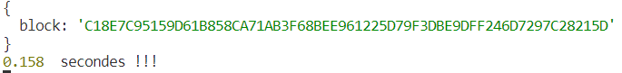

# Crypto Speed

# Description
Ce code utilise 3 modules Node.js : ws, reconnecting-websocket, et request.

Il crée une instance d'un objet ReconnectingWebSocket qui représente une WebSocket qui se reconnecte automatiquement lorsque la connexion est perdue. Le constructeur de cet objet prend comme premier argument l'URL de l'endpoint WebSocket à se connecter, et des options facultatives qui permettent de personnaliser le comportement de la WebSocket lors de la reconnexion.

Lorsque la connexion WebSocket est ouverte, le code envoie une demande de souscription à des confirmations de blocks à l'endpoint.

Il y a également une requête HTTP POST qui est envoyée à une URL spécifiée avec un corps de demande JSON.

Enfin, lorsqu'un message est reçu sur la WebSocket, le code vérifie si le message concerne une confirmation de block et, si c'est le cas, il affiche le temps pris pour recevoir la confirmation.
